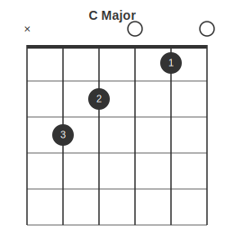
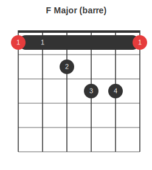
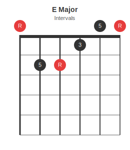
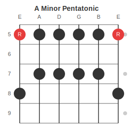
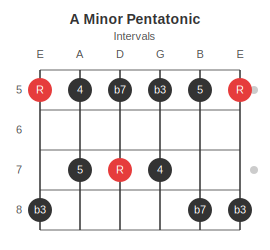
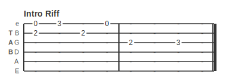
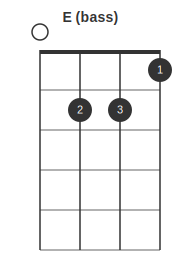
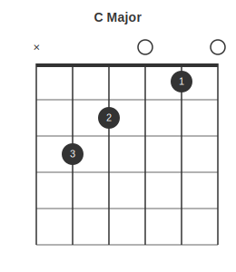
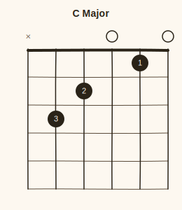

[](https://www.npmjs.org/package/fretdrom)

## Introduction

**Fretdrom** is a free and open source SVG rendering engine for stringed instrument diagrams. It converts a JSON5 description into SVG vector graphics for chord charts, scale boxes, and tablature.

The syntax is inspired by [WaveDrom](https://github.com/wavedrom/wavedrom): the top-level key determines the diagram type, and tab strings use a compact wave notation. Input is parsed from JSON5, which allows comments and unquoted keys. Diagrams can be embedded in web pages or generated from the command line.

Input syntax compatible with [pelican-fretboard](https://github.com/morganp/pelican-fretboard).

---

## CLI

### Run with npx

```bash
npx fretdrom --input chord.json5 > chord.svg
```

### Global installation

```bash
npm install -g fretdrom
fretdrom --input chord.json5 --skin dark > chord.svg
fretdrom --input scale.json5 --output scale.svg
```

### Options

- `-i`, `--input <path>`: Path to the JSON5 source file (required)
- `-s`, `--skin <name>`: Skin name: `default` or `dark` (default: `default`)
- `-o`, `--output <path>`: Write to file instead of stdout
- `-h`, `--help`: Show help message

### Export to PNG

```bash
fretdrom -i chord.json5 | npx @resvg/resvg-js-cli - chord.png
```

---

## Web usage

### HTML pages

1. Add the script to your `<head>` or `<body>`:

```html
<script src="https://unpkg.com/fretdrom/dist/fretdrom.min.js" type="text/javascript"></script>
```

2. Call `processAll` on load:

```html
<body onload="FretDrom.processAll()">
```

3. Insert diagram source wrapped in a `<script>` tag:

```html
<script type="fretdrom">
{ chord: { name: "C Major", frets: "x32010", fingers: "-32-1-" } }
</script>
```

Fretdrom finds all `<script type="fretdrom">` elements and replaces each with an inline SVG.

---

## Chord diagrams

The `chord` key takes an object. Frets and fingers can be written as compact strings -- one character per string, low to high.

```json5
{ chord: {
  name: "C Major",
  tuning:  "EADGBE",
  frets:   "x32010",
  fingers: "-32-1-"
}}
```



Fret characters: `x` = muted, `0` = open, `1`-`9` = fret number, `a`-`z` = frets 10-35 (a=10, b=11, c=12 ...).  
Finger characters: `-` = no label, `1`-`4` = finger number.

Barre chords use the `barre` key:

```json5
{ chord: {
  name: "F Major (barre)",
  frets:   "133211",
  fingers: "134211",
  root_strings: [1, 6],
  barre: { fret: 1, from_string: 1, to_string: 6 }
}}
```



Use `subtitle` to show intervals or any short annotation below the title:

```json5
{ chord: {
  name: "C Major",
  subtitle: "1 - 3 - 5",
  frets: "x32010"
}}
```

Use `intervals` to label each string's harmonic role inside the dots. When `intervals` is present without an explicit `subtitle`, the subtitle automatically shows `"Intervals"`. Set `subtitle: false` to suppress it.

```json5
{ chord: {
  name: "E Major",
  frets:     "022100",
  intervals: ["R", "5", "R", "3", "5", "R"]
}}
```



`intervals` is an array -- one entry per string, low to high. Use `null` or omit entries for strings with no label (open strings, muted strings, or fretted strings you want unlabelled).

### Chord keys

| Key | Description | Default |
|-----|-------------|---------|
| `name` | Diagram title | _(none)_ |
| `subtitle` | Second line below the title. Set to `false` to disable; auto-shows `"Intervals"` when `intervals` is in use | _(none)_ |
| `tuning` | String names low to high | `EADGBE` |
| `frets` | Fret per string, low to high (string or array) | required |
| `fingers` | Finger number per string (string or array, `-`/`null` = omit) | _(none)_ |
| `intervals` | Interval label per string, low to high (array, `null` = omit). Takes priority over `fingers` for dot labels | _(none)_ |
| `root_strings` | 1-indexed string numbers to show in accent colour | _(none)_ |
| `start_fret` | First fret shown. `1` draws a nut; higher values show a fret indicator | `1` |
| `barre` | `{fret, from_string, to_string}` -- draws a barre bar | _(none)_ |

See [docs/chords.md](docs/chords.md) for more chord examples with interval and finger subtitles.

---

## Scale diagrams

The `scale` key takes an object with a `grid` array -- one row per string, low to high.

```json5
{ scale: {
  name: "A Minor Pentatonic",
  tuning: "EADGBE",
  start_fret: 5,
  num_frets: 5,
  grid: [
    ["R", ".", ".", "x", "."],
    ["x", ".", ".", "x", "."],
    ["x", ".", "x", ".", "."],
    ["x", ".", "x", ".", "."],
    ["x", ".", "x", ".", "."],
    ["R", ".", ".", "x", "."]
  ]
}}
```



Strings are columns along the top; fret numbers label each row down the left side. Fret position markers (3, 5, 7, 9, 12 ...) appear on the right.

Use `subtitle` to label the scale intervals below the title:

```json5
{ scale: {
  name: "A Minor Pentatonic",
  subtitle: "R  b3  4  5  b7",
  start_fret: 5,
  num_frets: 5,
  grid: [ ... ]
}}
```

Use interval names directly as grid cell values to label each dot. Any cell value other than `"R"`/`"x"`/`"."`/`"-"` is treated as an interval label and shown inside the dot. When interval-labelled cells are present and no explicit `subtitle` is set, the subtitle automatically shows `"Intervals"`.

```json5
{ scale: {
  name: "A Minor Pentatonic",
  start_fret: 5,
  num_frets: 4,
  grid: [
    ["R",  ".", ".", "b3"],
    ["4",  ".", "5", "." ],
    ["b7", ".", "R", "." ],
    ["b3", ".", "4", "." ],
    ["5",  ".", ".", "b7"],
    ["R",  ".", ".", "b3"]
  ]
}}
```



| Cell value | Meaning |
|------------|---------|
| `"R"` or `"r"` | Root note -- rendered in accent colour with `R` label |
| `"x"` or `"X"` | Scale note -- filled dot, no label |
| `"b3"`, `"4"`, `"b7"` etc. | Scale note with interval label inside the dot |
| `"."` or `"-"` | Not in scale -- empty |

### Scale keys

| Key | Description | Default |
|-----|-------------|---------|
| `name` | Diagram title | _(none)_ |
| `subtitle` | Second line below the title (e.g., intervals `R  b3  4  5  b7`) | _(none)_ |
| `tuning` | String names low to high | `EADGBE` |
| `start_fret` | Fret number of the first row | `1` |
| `num_frets` | Height of the box in frets | `6` |
| `grid` | Array of rows, one per string | required |

See [docs/scales.md](docs/scales.md) for more scale examples with interval subtitles.

---

## Tablature

The `tab` key takes an array of string lanes -- one per string, highest to lowest (standard tab order). Each lane has a `name` and a `wave` string where each character is one beat position.

```json5
{ name: "Intro Riff",
  tab: [
    { name: "e", wave: "03.0...." },
    { name: "B", wave: "2.2....." },
    { name: "G", wave: "....2.3." },
    { name: "D", wave: "........" },
    { name: "A", wave: "........" },
    { name: "E", wave: "........" }
  ],
  config: { bar: 4 }
}
```



Wave characters: `.` = empty beat (renders as dash), `0`-`9` = fret number, `a`-`z` = frets 10-35, `x` = muted.

Bar lines are drawn automatically when `config.bar` specifies beats per bar.

### Tab keys

| Key | Description | Default |
|-----|-------------|---------|
| `name` | Diagram title | _(none)_ |
| `tab` | Array of `{name, wave}` lane objects, highest string first | required |
| `config.bar` | Beats per bar -- draws internal bar lines when set | _(none)_ |

---

## Any fretted instrument

Set `tuning` to match your instrument. String count is inferred from the frets or grid length.

```json5
{ chord: { name: "E (bass)", tuning: "EADG", frets: "0221", fingers: "-231", root_strings: [1] } }
```



Common tunings: `BEADG` (5-string bass), `GCEA` (ukulele), `GDAE` (mandola), `DADGAD` (open D).

---

## Skins

The `config.skin` key selects a colour scheme:

```json5
{ chord: { name: "C Major", frets: "x32010", config: { skin: "dark" } } }
```



```json5
{ chord: { name: "C Major", frets: "x32010", config: { skin: "sketch" } } }
```



| Skin | Description |
|------|-------------|
| `default` | Light background, charcoal lines, red root notes |
| `dark` | Dark background, light lines, bright red root notes |
| `sketch` | Warm off-white background, hand-drawn wobbly lines |
| `sketch-dark` | Dark background with hand-drawn style |

The `--skin` flag applies the same way on the CLI:

```bash
fretdrom -i chord.json5 --skin sketch > chord.svg
```

---

## Node.js API

```js
const { renderSVG } = require('fretdrom');

const svg = renderSVG({ chord: { name: 'C Major', frets: 'x32010' } });
// svg is a string of SVG markup
```

---

## License

See [LICENSE](LICENSE).
