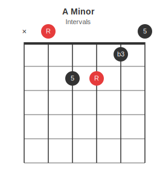

# Chord Diagrams

Chord diagrams support `fingers` for fingering labels, `intervals` for harmonic interval labels, and `subtitle` for a text line below the title. When `intervals` is present the subtitle defaults to `"Intervals"` automatically.

---

## Open Major Chords

### C Major

```json5
{ chord: {
  name: "C Major",
  subtitle: "1 - 3 - 5",
  frets: "x32010",
  fingers: "-32-1-"
}}
```


---

### G Major

```json5
{ chord: {
  name: "G Major",
  subtitle: "1 - 3 - 5",
  frets: "320003",
  fingers: "210004",
  root_strings: [1, 6]
}}
```


---

### D Major

```json5
{ chord: {
  name: "D Major",
  subtitle: "1 - 3 - 5",
  frets: "xx0232",
  fingers: "---132"
}}
```


---

## Open Minor Chords

### A Minor

```json5
{ chord: {
  name: "A Minor",
  subtitle: "1 - b3 - 5",
  frets: "x02210",
  fingers: "--231-",
  root_strings: [4]
}}
```


---

### E Minor

```json5
{ chord: {
  name: "E Minor",
  subtitle: "1 - b3 - 5",
  frets: "022000",
  fingers: "-23---",
  root_strings: [3]
}}
```


---

## Barre Chords

### F Major

```json5
{ chord: {
  name: "F Major",
  subtitle: "1 - 3 - 5",
  frets: "133211",
  fingers: "134211",
  root_strings: [1, 6],
  barre: { fret: 1, from_string: 1, to_string: 6 }
}}
```


---

## Other Instruments

### E (Bass)

```json5
{ chord: {
  name: "E (bass)",
  tuning: "EADG",
  frets: "0221",
  fingers: "-231",
  root_strings: [1]
}}
```


---

## Interval labels in dots

Use `intervals` instead of `fingers` to show each string's harmonic role inside the dots. The subtitle auto-shows `"Intervals"`. Set `subtitle: false` to suppress it.

### E Major (intervals)

```json5
{ chord: {
  name: "E Major",
  frets:     "022100",
  intervals: [null, "5", "R", "3", null, null],
  root_strings: [1, 3]
}}
```


### A Minor (intervals)

```json5
{ chord: {
  name: "A Minor",
  frets:     "x02210",
  intervals: [null, null, "5", "R", "b3", null],
  root_strings: [4]
}}
```



`intervals` is an array of strings, one per string low to high. Use `null` for strings with no label (open, muted, or unlabelled fretted strings). Values can be any text: `"R"`, `"3"`, `"b3"`, `"b7"`, `"#5"`, etc.

---

## Subtitle and label options

| Situation | Result |
|-----------|--------|
| `intervals` present, no `subtitle` | subtitle auto-shows `"Intervals"` |
| `fingers` present, no `subtitle` | no subtitle (opt-in only) |
| `subtitle: "text"` | shows that text regardless |
| `subtitle: false` | subtitle hidden even when intervals present |

Common `subtitle` values:

| Use | Example value |
|-----|---------------|
| Chord tones | `"1 - 3 - 5"` |
| Minor/altered | `"1 - b3 - 5"` |
| Alternate name | `"Capo 2: A shape"` |
