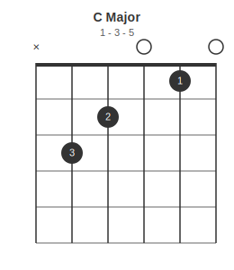
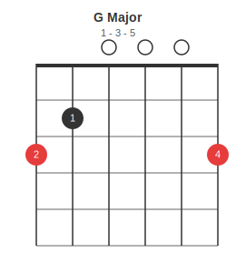
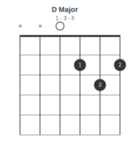
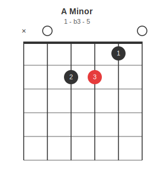
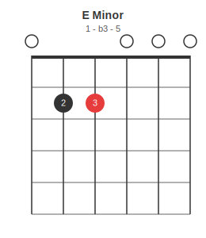
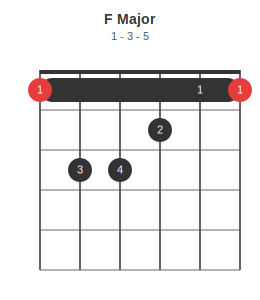

# Chord Diagrams

Chord diagrams support a `subtitle` key for displaying intervals or other annotations below the title.

---

## Open Major Chords

### C Major

```json5
{ chord: {
  name: "C Major",
  subtitle: "1 - 3 - 5",
  frets: "x32010",
  fingers: "-32-1-"
}}
```



---

### G Major

```json5
{ chord: {
  name: "G Major",
  subtitle: "1 - 3 - 5",
  frets: "320003",
  fingers: "210004",
  root_strings: [1, 6]
}}
```



---

### D Major

```json5
{ chord: {
  name: "D Major",
  subtitle: "1 - 3 - 5",
  frets: "xx0232",
  fingers: "---132"
}}
```



---

## Open Minor Chords

### A Minor

```json5
{ chord: {
  name: "A Minor",
  subtitle: "1 - b3 - 5",
  frets: "x02210",
  fingers: "--231-",
  root_strings: [4]
}}
```



---

### E Minor

```json5
{ chord: {
  name: "E Minor",
  subtitle: "1 - b3 - 5",
  frets: "022000",
  fingers: "-23---",
  root_strings: [3]
}}
```



---

## Barre Chords

### F Major

```json5
{ chord: {
  name: "F Major",
  subtitle: "1 - 3 - 5",
  frets: "133211",
  fingers: "134211",
  root_strings: [1, 6],
  barre: { fret: 1, from_string: 1, to_string: 6 }
}}
```



---

## Other Instruments

### E (Bass)

```json5
{ chord: {
  name: "E (bass)",
  tuning: "EADG",
  frets: "0221",
  fingers: "-231",
  root_strings: [1]
}}
```


---

## Subtitle options

The `subtitle` field is a free-form string. Common uses:

| Use | Example value |
|-----|---------------|
| Chord tones (intervals) | `"1 - 3 - 5"` |
| Minor/altered intervals | `"1 - b3 - 5"` |
| Finger numbers reminder | `"1 2 3 4"` |
| Alternate name | `"Capo 2: A shape"` |
