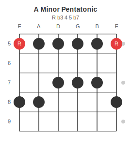
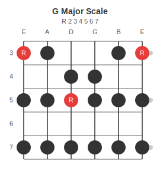

# Scale Diagrams

Scale diagrams support a `subtitle` key for a text annotation below the title. Grid cells can also hold interval names directly to label each dot -- when they do, the subtitle defaults to `"Intervals"` automatically.

---

## Pentatonic Scales

### A Minor Pentatonic

```json5
{ scale: {
  name: "A Minor Pentatonic",
  subtitle: "R  b3  4  5  b7",
  tuning: "EADGBE",
  start_fret: 5,
  num_frets: 5,
  grid: [
    ["R", ".", ".", "x", "."],
    ["x", ".", ".", "x", "."],
    ["x", ".", "x", ".", "."],
    ["x", ".", "x", ".", "."],
    ["x", ".", "x", ".", "."],
    ["R", ".", ".", "x", "."]
  ]
}}
```



Grid rows are strings low to high (E to e). Columns are fret positions starting at `start_fret`. Use `"R"` for the root note, `"x"` for other scale notes, and `"."` for empty positions.

---

## Major Scales

### G Major Scale

```json5
{ scale: {
  name: "G Major Scale",
  subtitle: "R  2  3  4  5  6  7",
  tuning: "EADGBE",
  start_fret: 3,
  num_frets: 5,
  grid: [
    ["R", ".", "x", ".", "x"],
    ["x", ".", "x", ".", "x"],
    [".", "x", "R", ".", "x"],
    [".", "x", "x", ".", "x"],
    ["x", ".", "x", ".", "x"],
    ["R", ".", "x", ".", "x"]
  ]
}}
```



This is the standard three-notes-per-string pattern in position 2 (starting at fret 3). The `"R"` cells mark the root note G in red; all other scale tones use `"x"`.

---

## Interval labels in dots

Replace `"x"` with the interval name to label each dot. The subtitle auto-shows `"Intervals"`. Set `subtitle: false` to suppress it.

### A Minor Pentatonic (interval labels)

```json5
{ scale: {
  name: "A Minor Pentatonic",
  start_fret: 5,
  num_frets: 4,
  grid: [
    ["R",  ".", ".", "b3"],
    ["4",  ".", "5", "." ],
    ["b7", ".", "R", "." ],
    ["b3", ".", "4", "." ],
    ["5",  ".", ".", "b7"],
    ["R",  ".", ".", "b3"]
  ]
}}
```


Any string other than `"R"`, `"x"`, `"."`, `"-"` is treated as an interval label and shown inside the dot. Root cells still use the accent colour; all other interval cells use the standard dot colour.

---

## Subtitle and label options

| Situation | Result |
|-----------|--------|
| Grid has interval labels, no `subtitle` | subtitle auto-shows `"Intervals"` |
| `subtitle: "text"` | shows that text regardless |
| `subtitle: false` | subtitle hidden even when interval labels present |

Common `subtitle` values:

| Use | Example value |
|-----|---------------|
| Scale formula | `"R  2  b3  4  5  b6  b7"` |
| Pentatonic formula | `"R  b3  4  5  b7"` |
| Mode name | `"Dorian"` |
| Key + position | `"Key of A, Position 1"` |

---

## Grid cell reference

| Cell | Meaning |
|------|---------|
| `"R"` or `"r"` | Root note, accent colour, `R` label |
| `"x"` or `"X"` | Scale note, filled dot, no label |
| `"b3"`, `"4"`, `"b7"` etc. | Scale note with interval label in the dot |
| `"."` or `"-"` | Not in scale, empty position |
