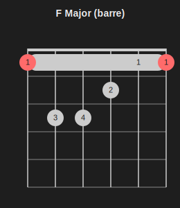
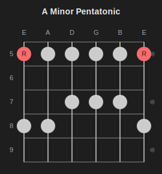
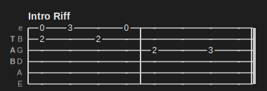
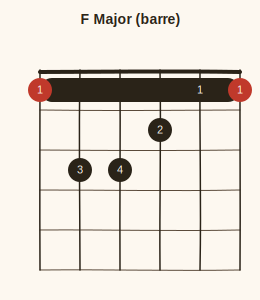
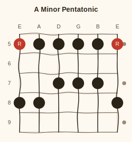
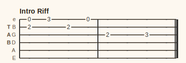
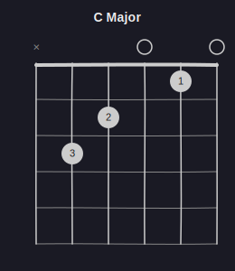
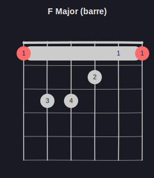
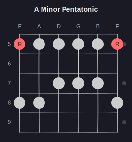

# Skins

Fretdrom has four built-in skins. Select one via the `--skin` CLI flag or the `config.skin` key inside your JSON5 source.

```bash
fretdrom -i chord.json5 --skin sketch > chord.svg
```

```json5
{ chord: { name: "C Major", frets: "x32010", config: { skin: "sketch" } } }
```

---

## default

Light background, charcoal lines, red root notes.

| Chord | Barre | Scale | Tab |
|-------|-------|-------|-----|
|  |  |  |  |

---

## dark

Dark background, light lines, bright red root notes.

| Chord | Barre | Scale | Tab |
|-------|-------|-------|-----|
|  |  |  |  |

---

## sketch

Warm off-white background with hand-drawn wobbly lines. Fret wires, strings, and the nut are rendered as deterministic cubic bezier paths instead of straight lines -- the same source always produces the same SVG.

| Chord | Barre | Scale | Tab |
|-------|-------|-------|-----|
|  |  |  |  |

---

## sketch-dark

Dark background with the same hand-drawn line style.

| Chord | Barre | Scale |
|-------|-------|-------|
|  |  |  |

---

## Combining skins with other features

Skins compose with all other diagram features -- intervals, subtitles, barre chords, and tunings all work the same way regardless of skin.

```json5
{ chord: {
  name: "E Major",
  frets:     "022100",
  intervals: ["R", "5", "R", "3", "5", "R"],
  config:    { skin: "sketch" }
}}
```
